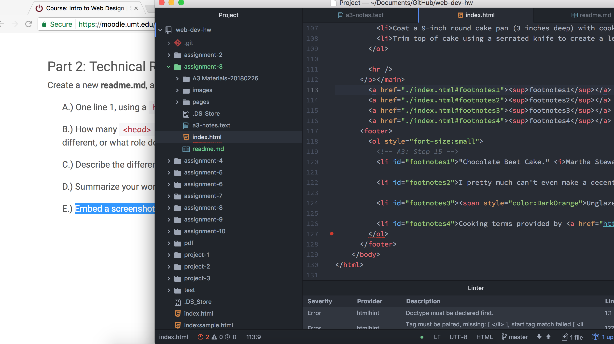

# Recipe web-page

*  How many <head> and <body> elements can a page have? How are these elements different, or what role do they play?
  - <head> Meta, viewport, title, link, style
  - <body> has structural, and semantic markup
  - The head is what builds up the information within the document such as what language the document will be created in, what type of code will be used to create the document, what the document is about (title), and what styles will be used.
  - The body will share the information using structural markup such as bullets, paragraphs, etc. And the words that are contained within can be stylized with semantic markup to provide emphasis where emphasis is due.
* Describe the difference between structural and semantic markup.
  - Structural markup is the structure of the document. How the document will be read, and how it will be outlined. The semantic markup is items like italics, and bold, etc. Semantic is for stylization within the text (not like CSS that brings in design elements) and structural marks up how the web page will be viewed such as to the right, or to the left, or in the center, or with bullets, or with headings and sub headings, etc.
* Summarize your work cycle for this assignment. Review this page if you need some ideas.
  - This work cycle was interesting. At first I thought that we had to create all the of the markdown on our own using the information provided within the resources folder as a reference and nothing more. Then once I realized that it was a template that we were supposed to adjust and tweak I started my project over, from the beginning- I was still having some trouble wrapping my head around the concept, so I then started from scratch again. At this point I was getting the hang of it and everything was running smoothly, that is until I landed on the section 14 of the .index page. I had no idea what I was supposed to do witht he superscripts. I still dont. I looked over my classmates work, and it looks as if most of them just completely deleted the task all together. The wording still doesn't make much sense to me. I'm certain it's user error on my part. I have a tendency to get hyper focused on something, so much so that I miss a completely logical explanation. I began realized I was putting too much time into such a small little detail that I have decided to move on now, and focus on other work.
* Embed a screenshot of your workspace at some point during your development cycle.
  - 
