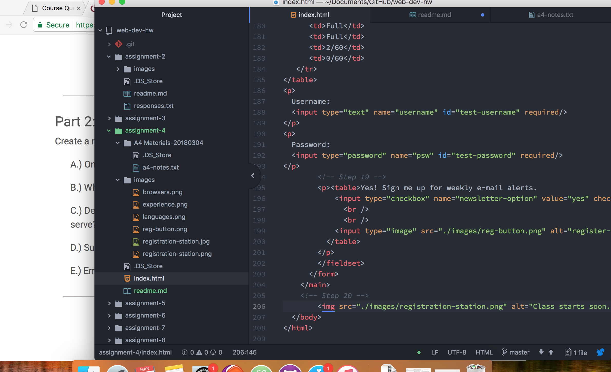

# I figured a form

* What is "alt text" why do we use it?
  -The "alt text" is a description of the image that is provided as a resource to those who are visually impaired.

* Forms i've encountered while browsing the web? What's their purpose?
  -The most recent form that I submitted while browsing the web was an application for a scholarship to help build a large art installation in Southern California. The purpose it served was to employ people who were somewhat skilled in the trade, in exchange for experience, lodging, and food. I wrote a compelling story about what large art/live art meant to me, and I was selected as a scholarship winner. Yay! Art is cool- Hooray forms! - This literally would never have happened if someone didn't spend a nice chunk of time creating the template to build that online form. WooHooo, web development is super valuable. I love the future.

* Summarize workcycle.
  - This workcycle was not too difficult- only time consuming. I haven't takent photoshop in a while so converting the file threw me for a loop. For the most part I would follow the instructions closely, take a general stab at what was being asked of me. I would then compare it to the example, and voila magick happened. I did struggle getting the registration button to be the perfect size. I don't recall any specific instructions on size so I just played around to be certain. Other then that I believe it was smooth sailing.

* Snapshot
    -
