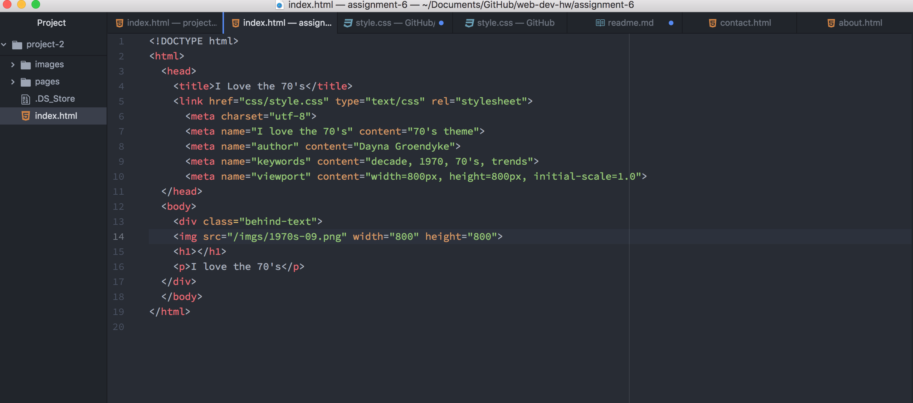

# Process for Assignment 6

* I chose to do the 70s for this assignment. For the images I chose. 1970s-01.png, 1970s-05.png, 1970s-09.png, and 1970s-love.png for my images. I chose to display them as part of the border, or bullets for listing. The colors that I chose were a slightly darker shade of the colors within the lower left hand border image. This was in an effort to compliment the colors that were already available in the images. I tried to style my page in a simple composition to reflect the simplicity of the mod culture of the 1970s. Even though I did choose to use more images than just one the images still served as a simple design, in my opinion.

* As mentioned above the colors that I chose were a slightly darker shade of the colors that are present within the outter lefhand boarder image. These colors are as follows. Seagreen, Forestgreen, Darkorange, Gold, Indianred - STILL NEED TO ADD RGB VALUES AND HEX CODES TO THIS document IT'S TOO DARK IN HERE TO READ NOTES

* As with all web development assignments it takes me a moment to get back into the swing of coding after taking a hiatus. I think this is because it is a different language so I have to train my brian to think from that perspective. Once I am able to get into that zone, I am able to work quickly and smoothly. It was easy to open the images that were provided and determine exactly how they would layout on the page, after mentally preparing a thumbnail of the direction I wanted to go in it was just a matter of exectution by writing the proper code. Overally I think it turned out exactly as I had envisioned.

* Embed a screenshot of your workspace at some point during your development cycle.
  - 
