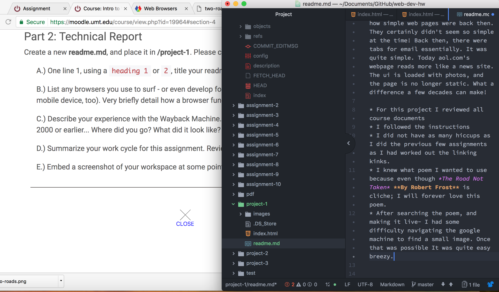

# My First Web Page Readme

## I use Google Chrome to surf the web.
- A browser functions by interpreting content sent from a web server, and displaying that content for us to view on the web. This is accomplished by a request being sent by the user within the browsers ui, to the server, and then a variety of files are sent to be rendered into legible content. These files are .html files, .css files, image files, and etc.

- The way back machine was interesting. I went to aol.com on January 11, 1998. I remember using AOL around this time on my parents Gateway computer (do those still exist?) It was interesting to see how simple web pages were back then. They certainly didn't seem so simple at the time! Back then, there were tabs for email essentially. It was quite simple. Today aol.com's webpage reads more like a news site. The ui is loaded with photos, and the page is no longer static. What a difference a few decades can make!

* For this project I reviewed all course documents
* I followed the instructions
* I did not have as many hiccups as I did the previous few assignments as I had worked out the linking kinks.
* I knew what poem I wanted to use because even though *The Road Not Taken* **By Robert Frost** is cliche; I will forever love this poem.
* After searching the poem, and making it live- I had some difficulty navigating the google machine to find a small image. Once that was possible It was quite easy breezy.

