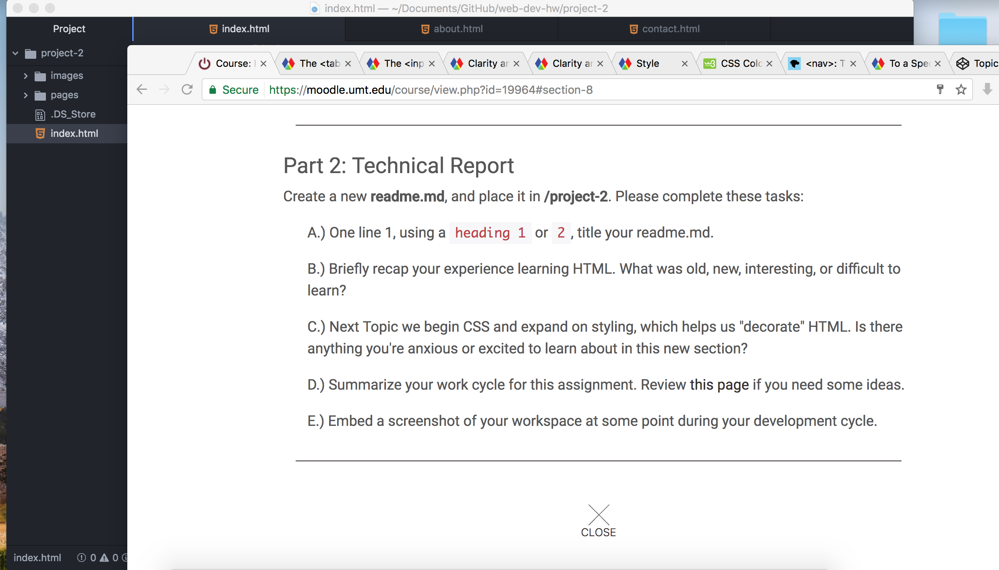

# This instructable
* This was a project that took me a long time to complete. I went through a lot of different variations before I was satisfied with the final outcome. To be honest there is plenty that I would like to adjust, but I am assuming there will be opportunities to tweak my code moving forward.
- I feel that as I moved along doing the work, I came to an agreement of what my workflow should look like moving forward. This was a great learning experience to further gain my confidence in using HTML, and also expand my experience with expanding my workflow for faster efficiency. I found that this lesson was fun. In terms of HTML I truly do enjoy coding, and I hope to do much more in the future.
- When it comes to CSS I am excited to learn ways to format the webpage in a efficient way that looks nice, and is functional for the user. In terms of my work cycle, I did a lot of studying before I executed the code. That is usually how I work. I spend the majority of the time fully digesting the information, and then moving on to doing the work.
- 
